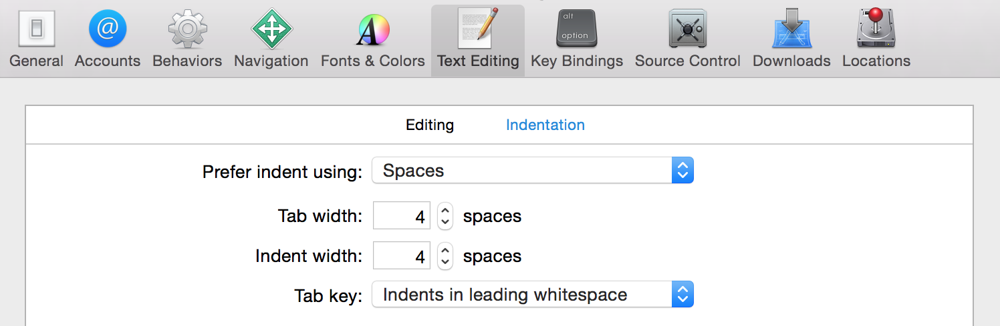

# Mokriya's Swift Style Guide

## Motivation

We created this style guide to keep the code in our applications and code reviews consistent. This document will be changed when there's valid reason to change it, and all of us should try to follow those guidelines. If we can all read and understand each other's code without discussing style it's time we all save.

## Goals

Our overarching goals are conciseness, readability, and simplicity.

## Table of Contents

* [Naming](#naming)
* [Spacing](#spacing)

## Naming

Use descriptive names with camel case for classes, methods, variables, etc. Class names and constants in module scope should be capitalized, while method names and variables should start with a lower case letter.

**Preferred:**

```swift
let MaximumWidgetCount = 100

class WidgetContainer {
  var widgetButton: UIButton
  let widgetHeightPercentage = 0.85
}
```

**Not Preferred:**

```swift
let MAX_WIDGET_COUNT = 100

class app_widgetContainer {
  var wBut: UIButton
  let wHeightPct = 0.85
}
```

For functions and init methods, prefer named parameters for all arguments unless the context is very clear. Include external parameter names if it makes function calls more readable.

```swift
func dateFromString(dateString: String) -> NSDate
func convertPointAt(column column: Int, row: Int) -> CGPoint
func timedAction(delay delay: NSTimeInterval, perform action: SKAction) -> SKAction!

// would be called like this:
dateFromString("2014-03-14")
convertPointAt(column: 42, row: 13)
timedAction(delay: 1.0, perform: someOtherAction)
```

For methods, follow the standard Apple convention of referring to the first parameter in the method name:
```swift
class Guideline {
  func combineWithString(incoming: String, options: Dictionary?) { ... }
  func upvoteBy(amount: Int) { ... }
}
```

## Spacing

* Indent using 4 spaces rather than tabs. That's the default for Xcode:

  

* Method braces and other braces (`if`/`else`/`switch`/`while` etc.) always open on the same line as the statement but close on a new line.

**Preferred:**
```swift
if user.isHappy {
  //Do something
} else {
  //Do something else
}
```

**Not Preferred:**
```swift
if user.isHappy
{
    //Do something
}
else {
    //Do something else
}
```

* There should be at least one blank line between methods to aid in visual clarity and organization. Whitespace within methods should separate functionality, but having too many sections in a method often means you should refactor into several methods.

## Credits

This style guide was initialy inspired by [raywenderlich's](https://github.com/raywenderlich/swift-style-guide).